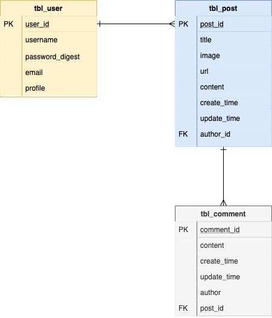

# **The +Side**

<br>

## Project Planning

<br>

<br>

<br>

### Overview


_**The +Side** is a positivity blog that alternates between a personalized gratitude post/daily positive journal and a good news article. Users can sign up for an account, sign in, post a blog article/gratitude piece, and add postive news article links. They can also edit these posts and delete them. Beyond this, users can comment on blog posts and news articles. The +Side is built using React front-end and Ruby on Rails back-end. Look at the + side of life!_

<br>

### MVP

- _Sign up_<br>
- _Sign in_<br>
- _+ blog post_<br>
- _+ news article_<br>
- _Editing and deletion of posts_<br>
- _Comments section_<br>
- _Rails Backend (API)_<br>
- _React Frontend_<br>
- _Authentication_<br>
- _At least 3 related models (User plus two others)_<br>
- _At least 1 association (one-to-many, many-to-many)_<br>
- _Full CRUD (can be spread between models)_<br>
- _Flexbox/Grid_<br>
- _Nicely styled, ready for your portfolio, and ready to show employees! (encouraged to use style libraries, Bulma, etc.)_<br>
- _Deployed on Surge/Heroku_<br>
- _Robust commit history (at least 5/day)_<br>
- _Code must be correctly indented and well styled (e.g., AirBnB Style Guide)_<br>
- _Remove console logs_<br>
- _README_<br>

<br>

#### Post-MVP Goals

- _Search Bar_<br>
- _Inspirational Quotes API_<br>
- _404 Page_<br>
- _Likes/Dislikes_<br>

<br>

### Wireframes

Marvel: (https://marvelapp.com/aced9gb/screen/67892523) <br>

#### Homepage


#### Sign Up


#### Sign In


#### User View


#### Create Blog Post & Add News Articles


#### Edit/Delete Blog Post & News Articles


<br>


#### Component Hierarchy

```
App.js      
|__ Container/
      |__ Hompage.jsx
      |__ Header.jsx
      |__ Navigation.jsx
      |__ Footer.jsx
      |__ Sign_Up.jsx
      |__ Sign_In.jsx
      |__ User_Feed.jsx
            |__ Create_Blog_Post.jsx
            |__ Edit_Blog_Post.jsx          
            |__ Delete_Blog_Post.jsx
            |__ Add_News_Article.jsx
            |__ Edit_News_Article.jsx
            |__ Delete_News_Article.jsx
            |__Create_Comment.jsx
            |__Edit_Comment.jsx
            |__Delete_Comment.jsx    
```

<br>

### ERD (Entity Relationship Diagram)



<br>

#### Component Estimates

| Task                | Priority | Estimated Time | Actual Time |
| ------------------- | :------: | :------------: | :---------: |
| Wireframe           |    H     |     2 hrs      |    2 hrs    |
| Initial Readme file |    H     |     5 hrs      |    10 hrs   |
| Authentication      |    H     |     8 hrs      |    TBD      |
| Header              |    H     |     3 hrs      |    TBD      |
| Footer              |    H     |     2 hrs      |    TBD      |
| Main container      |    H     |     5 hrs      |    TBD      |
| Sign Up             |    H     |     3 hrs      |    TBD      |
| Sign In             |    H     |     3 hrs      |    TBD      |
| User Feed Container |    H     |     5 hrs      |    TBD      |
| CRUD                |    H     |     9 hrs      |    TBD      |
| Styling             |    H     |     12 hrs     |    TBD      |
| 404 Page            |    L     |     1 hr       |     TBD     |
| Final Readme file   |    H     |     2 hrs      |     TBD     |
| TOTAL               |          |     60 hrs     |     TBD     |   

<br>


#### Libraries and API Endpoint Documentation

|     Library                          | Description                                                  |
| :----------------------------------: | :----------------------------------------------------------- |
| Rails Documentation                  | _Ruby on Rails Library._                                     |
| React Router                         | _React Router Library._                                      |
| CSS Tricks                           | _For help while styling web app._                            |
| Universal Inspirational Quotes API   | _Third party API used to render quotes into homepage on app._|
| StackOverflow                        | _For help while writing functional and class components._    |
| Unsplash                             | _Main header photo._                                         |
| GIPHY                                | _For videos used on main page, loading spinner, and 404 page._|
| Surge                                | _For deployment of front-end of web app._                    |
| Heroku                               | _For deployment of back-end of web app._                     |


<br>

### Technologies used
-_Giphy_<br>
-_Unsplash_<br>
-_Marvel App_<br>
-_draw.io_<br>

<br>

### List of server-side routes

```
blog_show:
    path:     /the-plus-side/:id
    methods:  [GET]

blog_create:
    path:     /the-plus-side
    methods:  [POST]

blog_edit:
    path:     /the-plus-side/:id/edit
    methods:  [GET]

blog_update:
    path:     /the-plus-side/:id
    methods:  [PUT]

blog_delete:
    path:     /the-plus-side/:id
    methods:  [DELETE]
```

<br>

### SWOT Analysis

_Strengths going into the project include my design skills and thoroughness in completion of projects. I pride myself on being very detail-oriented. Weaknesses and opportunities include re-learning how functions and classes are written in react. Threats include breaking of auth and back-end code, which I can anticipate for with my task time estimates and reach out to my resources during the project._<br>


<br>

<br>

***

## Project Delivery

<br>

### Link to deployed site: 

Surge(front-end): (link) <br>

Heroku(Back-end): (link) <br>

### Installation Instructions

_Installation instructions_<br>


#### Helper Functions

|  Function  | Description                                |
| :--------: | :----------------------------------------- |
| Footer     | _Footer function with links._              |
| 404 Page   | _No match page function._                  |
| Search Bar | _Search bar with input and submit button_  |


### Code Showcase

> Use this section to include a brief code snippet of functionality that you are proud of an a brief description  

```
function reverse(string) {
	// here is the code to reverse a string of text
}
```

### Code Issues & Resolutions

> Use this section to list of all major issues encountered and their resolution.

| Error                                                   | Resolution                                             |
| :------------------------------------------------------ | :----------------------------------------------------- |
| `app.js:34 Uncaught SyntaxError: Unexpected identifier` | Missing comma after first object in sources {} object. |


### Link to deployed site: 

Surge(front-end): (link) <br>

Heroku(Back-end): (link) <br>


***