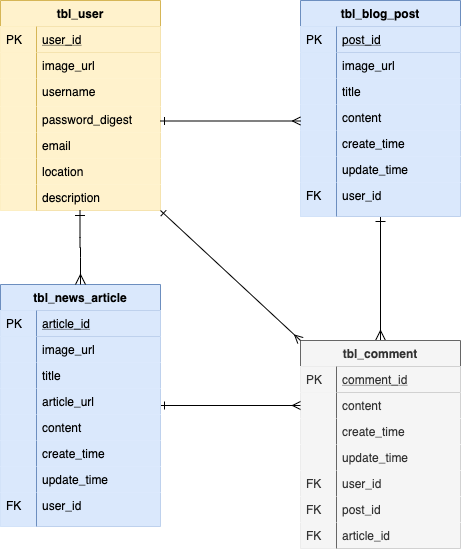

# **The +Side**

<br>

## Project Planning

<br>

<br>

<br>

### Overview

**The +Side** is a positivity blog that alternates between a personalized gratitude post/daily positive journal and a good news article. Users can sign up for an account, sign in, post a blog article/gratitude piece, and add postive news article links. They can also edit these posts and delete them. Beyond this, users can comment on blog posts and news articles. The +Side is built using React front-end and Ruby on Rails back-end. Look at the + side of life!

<br>

### MVP

- _Sign up_<br>
- _Sign in_<br>
- _+ blog post_<br>
- _+ news article_<br>
- _Editing and deletion of posts_<br>
- _Comments section_<br>
- _Rails Backend (API)_<br>
- _React Frontend_<br>
- _Authentication_<br>
- _At least 3 related models (User plus two others)_<br>
- _At least 1 association (one-to-many, many-to-many)_<br>
- _Full CRUD (can be spread between models)_<br>
- _Flexbox/Grid_<br>
- _Nicely styled, ready for your portfolio, and ready to show employees! (encouraged to use style libraries, Bulma, etc.)_<br>
- _Deployed on Surge/Heroku_<br>
- _Robust commit history (at least 5/day)_<br>
- _Code must be correctly indented and well styled (e.g., AirBnB Style Guide)_<br>
- _Remove console logs_<br>
- _README_<br>

<br>

#### Post-MVP Goals

- _Search Bar_<br>
- _Inspirational Quotes API_<br>
- _404 Page_<br>
- _Likes/Dislikes_<br>

<br>

### Wireframes

Marvel: (https://marvelapp.com/aced9gb/screen/67892523) <br>

#### Homepage


#### Sign Up


#### Sign In


#### User View


#### Create Blog Post & Add News Articles


#### Edit/Delete Blog Post & News Articles


<br>


#### Component Hierarchy

```
App.js      
|__ Container/
      |__ Hompage.jsx
      |__ Header.jsx
      |__ Navigation.jsx
      |__ Footer.jsx
      |__ Sign_Up.jsx
      |__ Sign_In.jsx
      |__ User_Feed.jsx
            |__ Create_Blog_Post.jsx
            |__ Edit_Blog_Post.jsx          
            |__ Delete_Blog_Post.jsx
            |__ Add_News_Article.jsx
            |__ Edit_News_Article.jsx
            |__ Delete_News_Article.jsx
            |__Create_Comment.jsx
            |__Edit_Comment.jsx
            |__Delete_Comment.jsx    
```

<br>

### ERD (Entity Relationship Diagram)



<br>

#### Component Estimates

| Task                  | Priority | Estimated Time | Actual Time |
| :-------------------: | :------: | :------------: | :---------: |
| Wireframe             |    H     |     2 hrs      |    2 hrs    |
| Initial Readme file   |    H     |     5 hrs      |    10 hrs   |
| Backend Authentication|    H     |     8 hrs      |    7 hrs    |
| Backend Models        |    H     |     8 hrs      |    8 hrs    |
| API routes            |    H     |     5 hrs      |    4 hrs    |
| Frontend Auth & Links |    H     |     3 hrs      |    6 hrs    |
| Article & Post CRUD   |    H     |     9 hrs      |    16 hrs   |
| Header(styling)       |    M     |     3 hrs      |    4 hrs    |
| Footer                |    L     |     2 hrs      |    1 hr     |
| Comments CRUD         |    M     |     4 hrs      |    4 hrs    |
| Overall styling       |    H     |     12 hrs     |    10 hrs   |
| Final Readme file     |    H     |     2 hrs      |    1 hr     |
| TOTAL                 |          |     73 hrs     |    TBD      |   

<br>


#### Libraries and API Endpoint Documentation

|     Library                          | Description                                                  |
| :----------------------------------: | :-----------------------------------------------------------:|
| Rails Documentation                  | _Ruby on Rails Library._                                     |
| React Router                         | _React Router Library._                                      |
| CSS Tricks                           | _For help while styling web app._                            |
| Universal Inspirational Quotes API   | _Third party API used to render quotes into homepage on app._|
| StackOverflow                        | _For help while writing functional and class components._    |
| Unsplash                             | _For wireframing and main header photo._                     |
| GIPHY                                | _For videos used on Readme, loading spinner, and 404 page._  |
| Surge                                | _For deployment of front-end of web app._                    |
| Heroku                               | _For deployment of back-end of web app._                     |


<br>

### Technologies Used
-_Giphy_<br>
-_Unsplash_<br>
-_Marvel App_<br>
-_draw.io_<br>

<br>

### List of Server-Side Routes

|         Prefix       |   Verb   |                        URI Pattern                                 |       Controller#Action       |
| :-------------------:| :------: | :----------------------------------------------------------------: | :---------------------------: |
| auth_login           | POST     | /auth/login(.:format)                                              |  authentication#login         |
| auth_verify          | GET      | /auth/verify(.:format)                                             |  authentication#verify        |
| users                | GET      | /users(.:format)                                                   |  users#index                  |
|                      | POST     | /users(.:format)                                                   |  users#create                 |
| user                 | GET      | /users/:id(.:format)                                               |  users#show                   |
|                      | PATCH    | /users/:id(.:format)                                               |  users#update                 |
|                      | PUT      | /users/:id(.:format)                                               |  users#update                 |
|                      | DELETE   | /users/:id(.:format)                                               |  users#destroy                |
| news_article_comments| GET      | /news_articles/:news_article_id/news_article_comments(.:format)    |  news_article_comments#index  |
|                      | POST     | /news_articles/:news_article_id/news_article_comments(.:format)    |  news_article_comments#create |
| news_article_comment | GET      | /news_articles/:news_article_id/news_article_comments/:id(.:format)|  news_article_comments#show   |
|                      | PATCH    | /news_articles/:news_article_id/news_article_comments/:id(.:format)|  news_article_comments#update |
|                      | PUT      | /news_articles/:news_article_id/news_article_comments/:id(.:format)|  news_article_comments#update |
|                      | DELETE   | /news_articles/:news_article_id/news_article_comments/:id(.:format)|  news_article_comments#destroy|
| news_articles        | GET      | /news_articles(.:format)                                           |  news_articles#index          |
|                      | POST     | /news_articles(.:format)                                           |  news_articles#create         |
| news_article         | GET      | /news_articles/:id(.:format)                                       |  news_articles#show           |
|                      | PATCH    | /news_articles/:id(.:format)                                       |  news_articles#update         |
|                      | PUT      | /news_articles/:id(.:format)                                       |  news_articles#update         |
|                      | DELETE   | /news_articles/:id(.:format)                                       |  news_articles#destroy        |
| blog_post_comments   | GET      | /blog_posts/:blog_post_id/blog_post_comments(.:format)             |  blog_post_comments#index     |
|                      | POST     | /blog_posts/:blog_post_id/blog_post_comments(.:format)             |  blog_post_comments#create    |
| blog_post_comment    | GET      | /blog_posts/:blog_post_id/blog_post_comments/:id(.:format)         |  blog_post_comments#show      |
|                      | PATCH    | /blog_posts/:blog_post_id/blog_post_comments/:id(.:format)         |  blog_post_comments#update    |
|                      | PUT      | /blog_posts/:blog_post_id/blog_post_comments/:id(.:format)         |  blog_post_comments#update    |
|                      | DELETE   | /blog_posts/:blog_post_id/blog_post_comments/:id(.:format)         |  blog_post_comments#destroy   |
| blog_posts           | GET      | /blog_posts(.:format)                                              |  blog_posts#index             |
|                      | POST     | /blog_posts(.:format)                                              |  blog_posts#create            |
| blog_post            | GET      | /blog_posts/:id(.:format)                                          |  blog_posts#show              |
|                      | PATCH    | /blog_posts/:id(.:format)                                          |  blog_posts#update            |
|                      | PUT      | /blog_posts/:id(.:format)                                          |  blog_posts#update            |
|                      | DELETE   | /blog_posts/:id(.:format)                                          |  blog_posts#destroy           |
| (custom route)       | POST	    | /users/:user_id/news_articles(.:format)	                           |  news_articles#create_by_user |
| (custom route)       | POST	    | /users/:user_id/blog_posts(.:format)	                             |  blog_posts#create_by_user    |

<br>

### SWOT Analysis

Strengths going into the project include my design skills and thoroughness in completion of projects. I pride myself on being very detail-oriented. Weaknesses and opportunities include re-learning how functions and classes are written in react. Threats include breaking of auth and back-end code, which I can anticipate for with my task time estimates and reach out to my resources during the project.<br>


<br>

<br>

***

## Project Delivery

<br>

<br>
<h4>Wooo! Project is complete and graduation is around the corner!!</h4>

<br>

### Link to deployed site: 

Surge(front-end): (http://the-plus-side.surge.sh/) <br>

Heroku(Back-end): (https://the-plus-side.herokuapp.com/) <br>

### Installation Instructions

1. Clone repository down with 'git clone https://github.com/Sunnydayz77/the-plus-side.git'
2. CD into repository
3. Run 'bundle install'
4. Run 'rails db:create'
5. Run 'rails db:migrate'
6. Run 'rails db:seed'
7. Run 'rails server' on 'http://localhost:3000/'
8. Create new terminal tab with 'command' + 't' on mac
9. CD in to client folder
10. Run 'npm install'
11. Run 'npm start' on 'http://localhost:3001/'


#### Helper Functions

|  Function  | Description                                |
| :--------: | :-----------------------------------------:|
| Footer     | _Footer function with links._              |

### Code Showcase

```
// Function to add a comment to an article
addCommentToArticle = async (articleItem) => {
  const newComment = await addCommentToArticle(articleItem.id, { content: this.state.selectedComment, news_article_id: articleItem.id });
  const news_article_comments = this.state.articleItem.news_article_comments;
  news_article_comments.push(newComment);
  this.setState(prevState => 
    ({ articleItem: { ...prevState.articleItem, news_article_comments } })
    )
}
```

### Code Issues & Resolutions

| Error                                                                                 | Resolution                                                                                        |
| :-----------------------------------------------------------------------------------: | :-----------------------------------------------------------------------------------------------: |
| `seeds.rb:27: ActiveRecord::RecordInvalid: Validation failed: User must exist`        | Needed to create a user association in seed file (user: user1)                                    |
| `App.js:8: TypeError: Cannot set property 'props' of undefined`                       | Had extra parentheses in "class App extends Component () {" in top app.js file                    |
| `App.js:51: TypeError: Cannot read property 'push' of undefined`                      | Needed to have { withRouter } imported for this.props.history.push to work                        |
| `createError.js:16: Uncaught( in promise) Error: Request failed with status code 422` | Created a custom route, re-did the addArticle function, and removed formData from this.setState |


### Link to deployed site (for quick reference while scrolling through readme file): 

Surge(front-end): (http://the-plus-side.surge.sh/) <br>

Heroku(Back-end): (https://the-plus-side.herokuapp.com/) <br>


***


